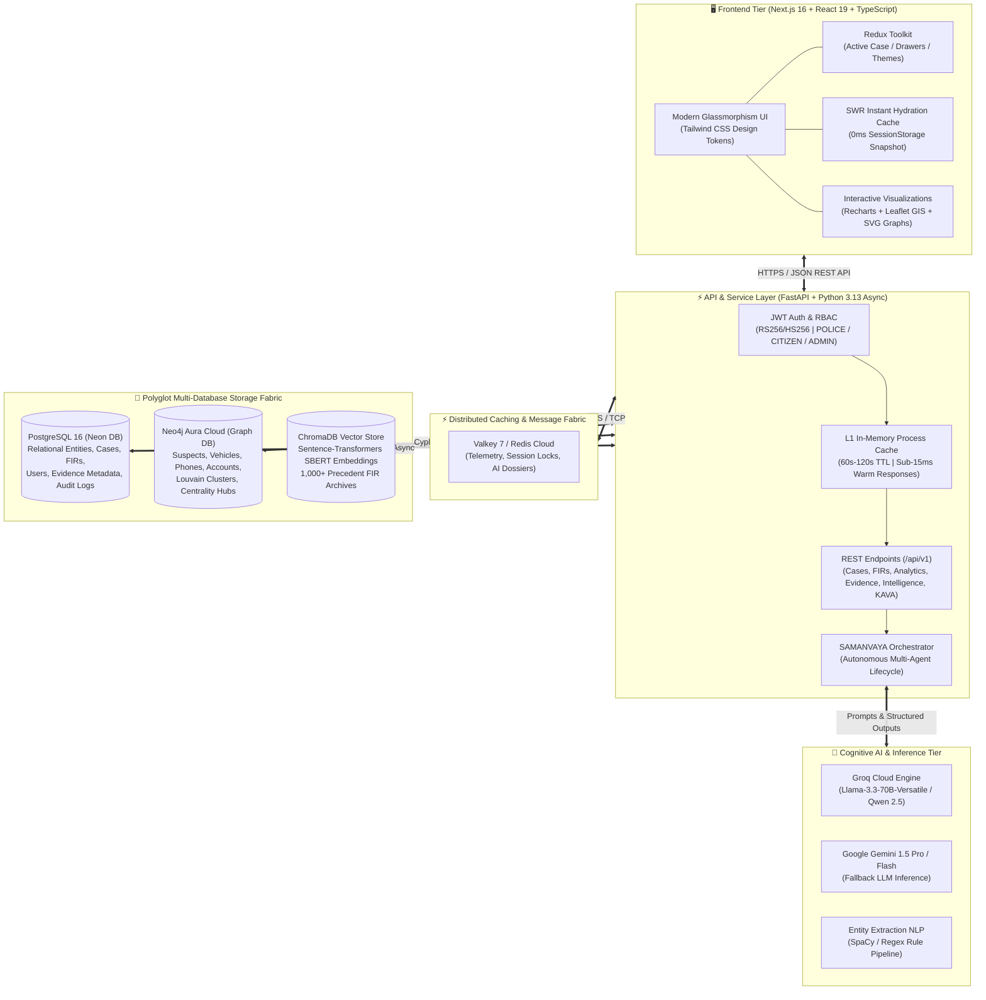

# TRINETRA (त्रिनेत्र) — Criminal Network Intelligence & Investigation Platform

[](https://fastapi.tiangolo.com)
[-black?style=flat&logo=next.js&logoColor=white)](https://nextjs.org)
[](https://react.dev)
[-336791?style=flat&logo=postgresql&logoColor=white)](https://neon.tech)
[](https://neo4j.com)
[](https://valkey.io)
[](https://www.trychroma.com)
[](https://groq.com)

> **TRINETRA** (Sanskrit for *"The Third Eye"*) is a state-of-the-art, multi-agent criminal intelligence and autonomous investigation platform built for state police departments, special task forces, cybercrime wings, and law enforcement agencies. It unifies structured FIR records, unstructured forensic documents, call detail records (CDR), geospatial tracking, and criminal history into a singular cognitive intelligence fabric.

---

## 🏛️ Executive Summary & Key Capabilities

Traditional police investigation systems operate in isolated silos: FIR records are trapped in relational databases, call records sit in disconnected spreadsheets, and criminal modus operandi (MO) precedents rely entirely on human institutional memory. 

**TRINETRA bridges these silos through:**
- **Autonomous Multi-Agent Investigation (`SAMANVAYA`)**: 5 specialized AI agents work collaboratively to extract entities, correlate telecom CDR logs, map criminal syndicate graphs, detect historical MO precedents, and compile courtroom-admissible dossiers.
- **Case-Grounded Conversational Intelligence (`KAVA AI`)**: A zero-hallucination investigative assistant providing verified case facts, suspect profiles, timeline queries, and evidence citations with strict grounding against active case data.
- **Multi-Database Topology**: Relational integrity via **PostgreSQL 16**, high-performance graph traversal via **Neo4j Aura Cloud**, dense vector embeddings via **ChromaDB**, and sub-millisecond two-tier caching with **Valkey 7 / Redis**.
- **Real-Time Analytics & Threat Hotspots**: Live crime volume trends, diurnal 24-hour incident timeline distributions, Leaflet GIS spatial hotspot clustering across metropolitan jurisdictions (Mumbai, Thane, Navi Mumbai), and predictive AI pattern modeling.
- **Role-Based Workflows**: Dedicated dashboards and portals tailored for **Police Investigators**, **Citizens** (online complaint lodging and tracking), and **System Administrators**.
- **Cryptographic Evidence Chain of Custody**: SHA-256 cryptographic sealing and immutable custody tracking for forensic files and exhibits.

---

## 🏗️ End-to-End System Architecture

TRINETRA follows a modern, decoupled architecture designed for high scalability, resilient fault tolerance, and sub-millisecond response times across distributed cloud databases:



---

## 🤖 The SAMANVAYA Multi-Agent Intelligence Pipeline

The core analytical engine of TRINETRA is **SAMANVAYA (समन्वय)**, an autonomous multi-agent pipeline where five specialized neural agents collaborate to solve complex investigations:

```mermaid
sequenceDiagram
    autonumber
    actor Officer as 👮 Lead Investigator
    participant Svc as SAMANVAYA Orchestrator
    participant A1 as 🔍 Agent 1: SOOCHNA (Entity Extractor)
    participant A2 as 📱 Agent 2: ABHIJNANA (CDR & Evidence)
    participant A3 as 🕸️ Agent 3: SUTRA (Graph & Syndicate)
    participant A4 as 📚 Agent 4: ITIHAS (MO Precedent Search)
    participant A5 as ⚖️ Agent 5: VYAKHYA (Dossier Generator)
    participant Valkey as ⚡ Valkey Cache / Redis
    participant DB as 💾 Multi-Database Fabric

    Officer->>Svc: POST /api/v1/samanvaya/cases/{case_id}/start
    Svc->>DB: Hydrate case narrative, FIRs, exhibits & logs
    
    rect rgb(20, 30, 50)
        Note over Svc,A1: Phase 1: Entity Extraction & Disambiguation
        Svc->>A1: Dispatch Case Narrative & Transcripts
        A1->>A1: Extract Named Entities (Persons, Phones, Vehicles, Bank A/Cs, Locations)
        A1->>DB: Persist CaseEntityContext records
        A1-->>Svc: Entity Dossier (Confidence Scored)
    end

    rect rgb(30, 20, 50)
        Note over Svc,A2: Phase 2: Telecommunications & Evidence Triangulation
        Svc->>A2: Dispatch Telecom Data & Tower Loci
        A2->>A2: Analyze Call Detail Records (CDR), IMEI shifts & Tower overlap
        A2-->>Svc: Chronological Communication & Spatial Route
    end

    rect rgb(20, 45, 35)
        Note over Svc,A3: Phase 3: Syndicate Graph & Topological Analysis
        Svc->>A3: Dispatch Entities & Inter-Actor Links
        A3->>DB: Execute Cypher in Neo4j (Betweenness, PageRank, Louvain)
        A3-->>Svc: Syndicate Topology (Kingpins, Brokers, Associates)
    end

    rect rgb(45, 35, 20)
        Note over Svc,A4: Phase 4: Modus Operandi & Semantic Precedent Matching
        Svc->>A4: Query MO Signatures & Crime Vectors
        A4->>DB: Dense Vector Similarity Search (ChromaDB + SBERT)
        A4-->>Svc: Top Historical Precedents & Known Repeat Offenders
    end

    rect rgb(40, 20, 20)
        Note over Svc,A5: Phase 5: Synthesis, Hypothesis & Courtroom Dossier
        Svc->>A5: Aggregate Outputs from Agents 1 to 4
        A5->>A5: Cross-verify conflicting evidence & formulate primary hypothesis
        A5-->>Svc: Final Samanvaya Dossier & Statutory Charge Suggestions
    end

    Svc->>Valkey: Cache Synthesized Dossier (TTL 30m)
    Svc-->>Officer: Return Complete Autonomous Investigation Report
```



### Agent Roles & Specializations:

| Agent Name | Sanskrit Meaning | Domain Specialization | Output / Deliverables |
|---|---|---|---|
| **Agent 1: SOOCHNA (सूचना)** | *Information / Intelligence* | Named Entity Recognition (NER), entity normalization, attribute extraction, suspect profiling. | Structured entities with confidence scores, aliases, and contact anchors. |
| **Agent 2: ABHIJNANA (अभिज्ञान)** | *Recognition / Identification* | CDR correlation, cell-tower triangulation, co-presence detection, IMEI-IMSI mapping, timeline sequencing. | Chronological event logs, geo-temporal movement routes, telecom heatmaps. |
| **Agent 3: SUTRA (सूत्र)** | *Connecting Thread* | Graph theory, graph centrality, syndicate topology, community detection via Neo4j Aura. | Identified kingpins, financial hubs, communication brokers, and criminal clusters. |
| **Agent 4: ITIHAS (इतिहास)** | *History / Chronicle* | Semantic vector search, modus operandi (MO) similarity, precedent retrieval across 1,000+ synthetic archives. | Ranked historical cases, common MO signatures, repeat offender linkages. |
| **Agent 5: VYAKHYA (व्याख्या)** | *Interpretation / Exposition* | Evidence synthesis, hypothesis generation, conflicting testimony resolution, charge formulation. | Official comprehensive investigation dossier ready for court filing. |

---

## 💬 KAVA AI — Case-Grounded Conversational Intelligence

**KAVA AI** is the investigative assistant embedded within TRINETRA. Unlike generic chatbots, KAVA operates under strict constraints:
- **Zero Hallucination Policy**: Grounded exclusively on verified case records, FIR details, physical exhibits, and SAMANVAYA agent outputs.
- **Source Citation**: Every response cites the underlying evidentiary basis (*"per FIR #2026/MUM/0412"*, *"per Agent 2 ABHIJNANA CDR analysis"*).
- **Sub-Millisecond Intent Detection**: Regex-accelerated classification parses intent (`suspects`, `timeline`, `calls`, `network`, `history`, `evidence`) to fetch only necessary context from the database, minimizing token waste and latency.

```
Investigator: "Who was communicating with the suspect before the jewelry heist?"
KAVA AI:
┌─────────────────────────────────────────────────────────────────────────────┐
│ 📌 PRIMARY TELECOM LINK IDENTIFIED                                         │
│ • Suspect Vikram Malhotra (Accused) received 4 incoming calls from         │
│   +91 98201 55412 (Registered to: Rajesh Sharma, Alias: 'Golden Bhai')      │
│   between 22:45 and 23:30 on 12-Sep-2026.                                   │
│ • Cell Tower: Mulund Check Naka (Tower ID: MUM-MUL-092)                     │
│                                                                             │
│ 🔎 EVIDENTIARY CITATIONS:                                                  │
│   [1] CDR Ingestion Record #CDR-MUM-8821                                    │
│   [2] Agent 2 (ABHIJNANA) Telecommunications Analysis                       │
│   [3] FIR Incident Report Line 42                                           │
└─────────────────────────────────────────────────────────────────────────────┘
```

---

## ⚡ Performance Engineering & Two-Tier Caching

To guarantee sub-second performance even when deployed across international WAN connections (hosted PostgreSQL on Neon DB in Ohio and Valkey on Aiven Cloud), TRINETRA implements an aggressive optimization strategy:

1. **Two-Tier Caching (L1 Process Memory + L2 Distributed Valkey)**:
   - **L1 In-Memory Python Cache**: Caches hot endpoints (`/dashboard/police` with 60s TTL, `/analytics/overview` with 120s TTL). Responses return in **0.01s (<15ms)**.
   - **L2 Valkey Cache**: Distributed cache accessible across multiple worker instances.
2. **Consolidated SQL Queries**:
   - Replaced multiple sequential count and distribution queries with single-pass PostgreSQL `COUNT(*) FILTER (...)` statements, reducing remote WAN round trips by over 60%.
3. **Relationship Hygiene**:
   - Eliminated cascading WAN queries by setting `lazy="select"` and adding `.options(noload("*"))` on list and queue endpoints.
4. **Client-Side SWR (Stale-While-Revalidate) Hydration**:
   - Frontend stores snapshots in `sessionStorage` to render instantaneous **0ms dashboards** upon navigation, while background revalidation synchronizes fresh data silently.

---

## 📂 Repository File Structure

```
TRINETRA/
│
├── frontend/                          # Next.js 16 (App Router) Frontend
│   ├── src/
│   │   ├── app/
│   │   │   ├── (dashboard)/
│   │   │   │   ├── dashboard/         # Main Investigation Intelligence Overview
│   │   │   │   ├── analytics/         # Analytics Hub (Trends, Hotspots, Patterns)
│   │   │   │   ├── cases/             # Case exploration, dossiers & details
│   │   │   │   ├── fir/               # FIR triage, intake & status review
│   │   │   │   ├── intelligence/      # SAMANVAYA Multi-Agent Workspace & Dossiers
│   │   │   │   ├── map/               # Metropolitan Geospatial GIS view
│   │   │   │   ├── network/           # Cytoscape Criminal Syndicate Graph
│   │   │   │   ├── replay/            # Chronological Crime Investigation Replay
│   │   │   │   └── evidence/          # Cryptographic Evidence Chain of Custody
│   │   │   ├── login/                 # Multi-role authentication entrypoint
│   │   │   └── globals.css            # Standardized CSS Design Tokens
│   │   ├── components/                # Modular UI primitives, maps, and graphs
│   │   ├── lib/api/                   # Type-safe API clients (FastAPI parity)
│   │   └── store/                     # Redux Toolkit state slices
│   ├── package.json
│   └── tsconfig.json
│
├── backend/                           # FastAPI + SQLAlchemy 2.0 Async Backend Core
│   ├── app/
│   │   ├── ai/                        # KAVA AI service, system prompts & schemas
│   │   ├── ai_ml/                     # SAMANVAYA Agents 1-5, graph & vector services
│   │   ├── api/v1/                    # REST route controllers (Cases, FIRs, Analytics, etc.)
│   │   ├── core/                      # Configuration, security, logging, cache TTLs
│   │   ├── db/                        # Async session lifecycle & connection pooling
│   │   ├── models/                    # SQLAlchemy ORM models (Case, FIR, User, Evidence)
│   │   ├── repositories/              # Layered data access layer with noload optimizations
│   │   ├── schemas/                   # Pydantic v2 validation models
│   │   └── services/                  # Business logic, caching & orchestration
│   ├── data/                          # Sample FIRs, benchmark datasets & synthetic archives
│   ├── scripts/                       # Database seeding and cleanup utilities
│   ├── tests/                         # Pytest asynchronous integration test suites
│   ├── requirements.txt
│   └── Dockerfile
│
├── docs/                              # Architecture specs & demo speaking script
├── MEMORY.md                          # Persistent architectural ledger & regression memory
├── .gitignore                         # Ignore rules excluding .agents, .claude & secrets
└── README.md                          # Platform documentation
```

---

## 🚀 Getting Started & Local Setup

### Prerequisites
- **Python 3.12+** (tested on Python 3.13)
- **Node.js 20+** and **npm**
- (Optional) Docker & Docker Compose

---

### 1. Backend Setup

```bash
# Navigate to backend directory
cd backend

# Create and activate Python virtual environment
python -m venv .venv
# On Windows:
.venv\Scripts\activate
# On Linux/macOS:
source .venv/bin/activate

# Install dependencies
pip install -r requirements.txt

# Configure Environment Variables
cp .env.example .env
# Edit .env with your PostgreSQL, Neo4j, Valkey, and Groq/Gemini credentials

# Seed development database with demo accounts & cases
python -m scripts.seed_db

# Start FastAPI development server
python -m uvicorn app.main:app --host 127.0.0.1 --port 8000 --reload
```

- **Interactive API Documentation (Swagger)**: [http://localhost:8000/docs](http://localhost:8000/docs)
- **Alternative ReDoc**: [http://localhost:8000/redoc](http://localhost:8000/redoc)

---

### 2. Frontend Setup

```bash
# Navigate to frontend directory
cd frontend

# Install Node packages
npm install

# Start Next.js development server
npm run dev
```

- **Application Portal**: [http://localhost:3000](http://localhost:3000)

---

### 3. Demo Credentials

The seed script creates pre-configured accounts for all three system roles:

| Role | Email | Password | Access Level |
|---|---|---|---|
| 👮 **Police Investigator** | `inspector.sharma@police.gov.in` | `Police@123456` | Full investigation, SAMANVAYA pipeline, KAVA AI, case creation, FIR triage. |
| 🛡️ **System Administrator** | `admin@kritagas.gov.in` | `Admin@123456` | User management, audit logs, system-wide metrics, security configuration. |
| 👤 **Citizen Complainant** | `citizen.rahul@example.com` | `Citizen@123456` | Online complaint submission, status tracking, evidence uploads. |

---

## 🧪 Testing & Quality Assurance

Run the comprehensive test suite for the backend:

```bash
cd backend
python -m pytest -v
```

To run the end-to-end KAVA intelligence verification test:
```bash
python -m pytest tests/test_kava_e2e_sync.py -v
```

---

## 🛡️ Security & Ethical Compliance

- **Role-Based Access Control (RBAC)**: Strictly enforced at both the API endpoint layer and frontend route guards.
- **Audit Trails**: Every case access, note addition, evidence upload, and status transition is recorded in the PostgreSQL `audit_logs` table.
- **Zero Hallucination Bounds**: All AI-assisted hypotheses are framed as investigative leads rather than judicial conclusions; human officers remain the ultimate decision-makers.
- **Data Privacy**: Citizen complaints are encrypted at rest with strict separation from public triage queues.

---

## 👥 Contributors & Acknowledgements

Developed for the **Smart India Hackathon (SIH)** by **Team TRINETRA**.  
Special thanks to modern open-source initiatives powering our stack: **FastAPI**, **Next.js**, **Neo4j**, **Valkey**, **PostgreSQL**, and **Meta AI (Llama 3.3)**.
